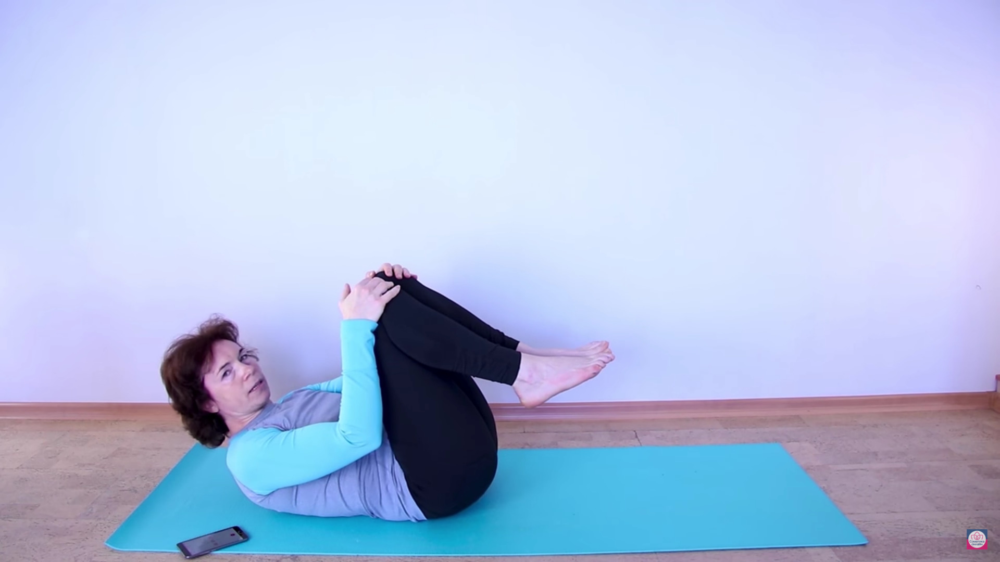
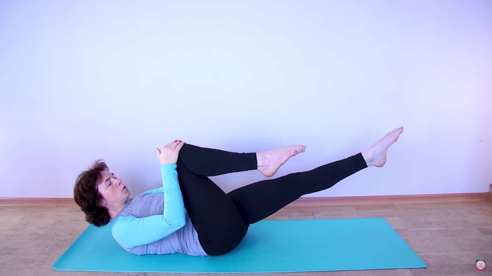
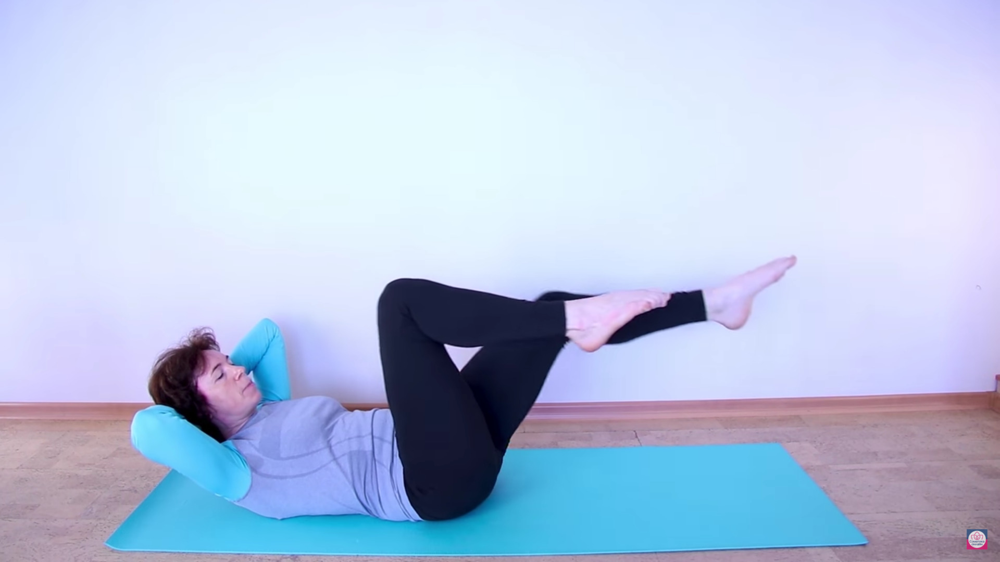
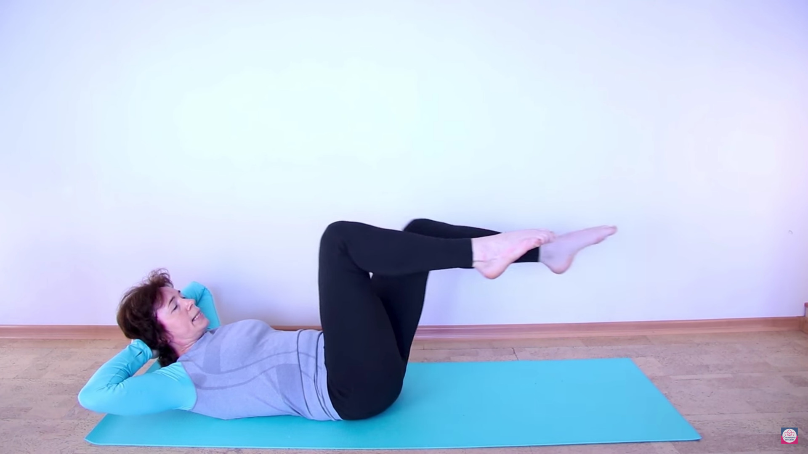
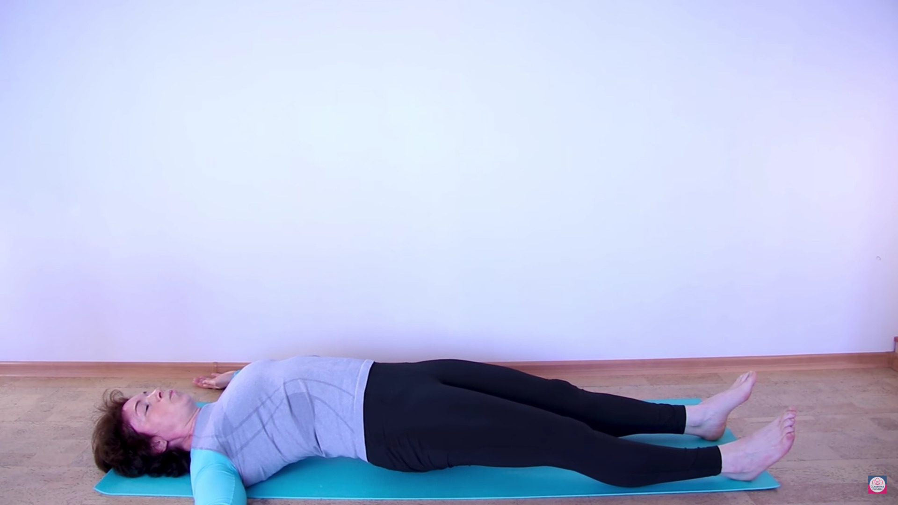

# 4 минуты в неделю = плоский здоровый живот

[Видео урока от 24.01.2018](https://www.youtube.com/watch?v=eNPaxqc3p7I).

Добрый день! На сегодняшнем видеоуроке мы разберем несложные упражнения для
прямых мышц живота и прямых мышц бедра, и это упражнение на вид кажется очень
несложным и занимает в первой части всего 2 минуты. Потом мы выполним в более
сложном варианте, где будем выполнять три минуты, и очень важно, чтобы это
упражнение выполнялось правильно. Нам важно стимулировать работу прямых мышц
живота, чтобы они подтянулись от лобкового симфиза до грудной клетки. Они
выполнят механическую работу по поддерживанию наших внутренних органов.

Также в этой работе нам нужно будет включить короткие сгибатели шеи, которые
являются антагонистами для коротких разгибателей, и в следующем кусочке мы
выключим их, то есть у нас из цепочки уйдет одна группа мышц.

Ну что, попробуем его выполнить. Я буду выполнять в течение минуты и минуты
вместе с таймером. Если для вас это окажется тяжело, то тогда начинаем так: 15
секунд и 15 секунд. Как только стало получаться, упражнение стало для вас
комфортным, вы легко отслеживаете все параметры движения, мы увеличиваем
время: 20 секунд и 20 секунд. Наша задача сделать так, чтобы мы работали
минуту и минуту. У нас будет работа статическая, где будут участвовать белые
волокна и динамические, где будет происходить сокращение. Поэтому медленно
постепенно увеличиваем количество времени в этом упражнении.

Обращаем внимание, что если мы работаем и работа идет именно на укрепление
мышц, нам обязательно нужна пауза. Достаточно выполнять это упражнение два
раза в неделю. Поэтому еще одно, но важное замечание: у нас ни в коем случае
не должны чувствоваться мышцы спины. У нас должны после упражнений
чувствоваться только прямые мышцы живота. Первое время будут чувствоваться
мышцы шеи, потом эти ощущения должны исчезнуть.

**[02:00]** Готовы? Ложимся на спину. Не спеша: более глубокий вдох-выдох. С
выдохом отпускаем напряжение, и почувствуйте все свое тело. Для выполнения
упражнений мы прижимаем поясницу, сгибаем ноги в коленях и подтягиваем колени
к грудной клетке.

Опираясь на руки, медленно приподымаемся вверх. Если получается, мы отрываем
лопатки и теперь мы обхватили колено — не тянем, мы именно просто держим руки,
— выпрямляем ножку. Представляем, что наши носочки по одной линии и должны
будут двигаться вперед и назад. При этом наша голова должна быть приподнята, и
мы будем следить за тем, как двигаются наши колени.

**[02:44]** Я включаю время, и мы начинаем смещаться – медленно. Обязательное
условие: нам нужно выполнять это упражнение медленно, чтобы мы могли
контролировать положение и движение нашего бедра. Обратите внимание: очень
часто бедро движется по дуге внутрь или наружу. Нам важно, чтобы наша
коленочка двигалась точно на стопу и нижняя ножка, которую мы (ближайшую)
сгибаем, — она на уровне пальчиков верхней ноги.

Продолжаем это делать движение. Если вы чувствуете нагрузку на короткие
сгибатели шеи, мы можем поменять. Как только вы отследили ноги, стопы, и мы
стараемся выпрямлять ногу в колене и чуть-чуть подтягивать мышцы живота затем,
чтобы у нас ножка в колене разгибалась и чтобы у нас ноги двигались синхронно
то есть не по отдельности — это не велосипед, — а именно двигались синхронно.

**[03:45]** Очень хорошо... Переплетаем пальцы рук, положили под затылок,
сняли нагрузку с мышц шеи и продолжаем выполнять это движение. Никуда не
торопимся, наша задача сделать это движение качественно. Выпрямили, подтянули
мышцы живота. Ножки двигаются, синхронно идет смена: одна, вторая. Следим за
тем, как двигаются колени: где наши пятки. Пяточка двигается точно в одной
линии. Следим за этим движением, и если получается, мы выпрямляем на выдохе
ножку — раз чуть-чуть живот подтянули! Поясничка обязательно прижата, у нас
нет ощущений в пояснице — вся нагрузка только на прямые мышц живота.

Медленно продолжаем это движение… Хорошо. Если хотим догрузить, разогнули
локоточки. Следим за тем, чтобы локти были в сторону. Мягко. Выдох. Хорошо,
осталось совсем чуть-чуть. Отлично!

Подтянули колени к грудной клетке, опустили сначала корпус, затем одну ногу,
вторую. Выпрямили ноги, расслабились, и теперь чтобы растянуть мышцы, чтобы
сделать их амплитуднее, нам нужно включить противоположную группу мышц, нам
нужно включить антагонисты.

**[05:06]**. Разводим руки Т-образно. Мне немножко надо сместиться. Ноги на
ширине плеч. Медленно. Сначала собираем лопатки и плечи. Если не хватает места
как мне, можно ручки согнуть в локтях. Собрали лопатки, плечи, напрягли
ягодицы, у нас лобковая кость пошла вперед, и приподнялись на пяточках.

Мы включили заднюю группу мышц. Выполняем это движение, чтобы скомпенсировать
работу передней группы мышц. Постояли и, удерживая ягодицы прижатыми, от
грудной клетки опустились вниз и расслабились.

Отлично, сгибаем ногу в колене и не спеша садимся.

Это упражнение призвано научить нас при статической нагрузке сохранять
управление ногами. Следить за тем, как они двигаются, и вы заметите эффект уже
в ближайшие там одну-две недели, что у вас мышцы живота подтягиваются и вы
ощущаете себя комфортно.

Желаю успехов в освоении собственного тела!